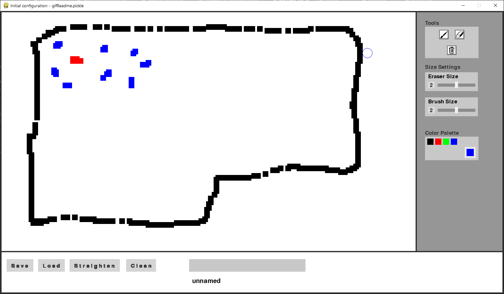
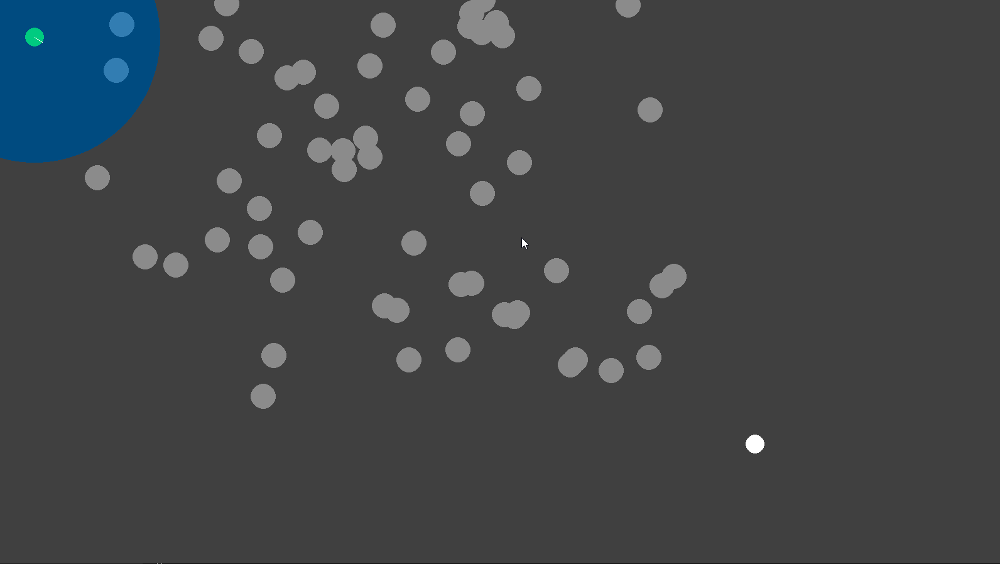
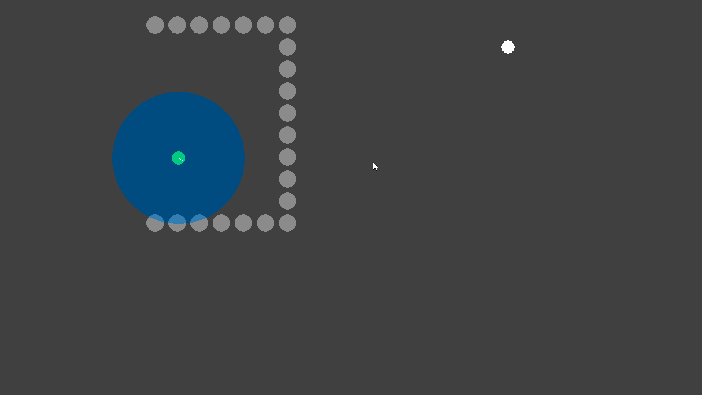

# Swarm of robots
Personal initiative project on the development of control algorithms for a swarm of robots.  
Created by Yoni Gozlan and Pierre Sanson.

## Graphical simulation:

The graphical simulation consists of a Paint-like interface on which you can draw the plan of the room and then add robots of different types. Each color corresponds to a type of robot: blue for an anchor robot, green for an explorer robot, and red for a measuring robot.

</img>

Once the room is drawn, the "straighten" and "clean" buttons can be used to obtain a clean version of the room plan.

</img> 

Finally, the drawing of the room and the different robots are converted into a simulation of the swarm of robots in the drawn room.

</img>

  
## Obstacle detection and avoidance algorithm:

During the operation of the swarm, each robot will set different objectives one after the other. In order to achieve them, they must detect obstacles on their path, whether they are fixed or mobile (like other robots for example), and try to avoid them.
The obstacle avoidance algorithm is therefore one of the main algorithms governing the behavior of robots.
We present below two of the technical challenges we had to face when creating this algorithm.

### Obstacle clustering:

Lorque deux obstacles sont trop proches les uns des autres, il faut effectuer un clustering d'obstacles, afin que le robot voie les deux obstacles comme un obstacle unique et tente de le contourner plutôt que d'essayer de passer entre les deux. Ce principe peut ensuite être étendu à un nombre quelconque d'obstacles.

</img>

### Exiting a concave obstacle:

A robot can be blocked by a concave obstacle (a semicircle, for example) that surrounds it and prevents it from reaching its goal. It then has to get out of it and go around it in order to continue towards its goal.

</img>

